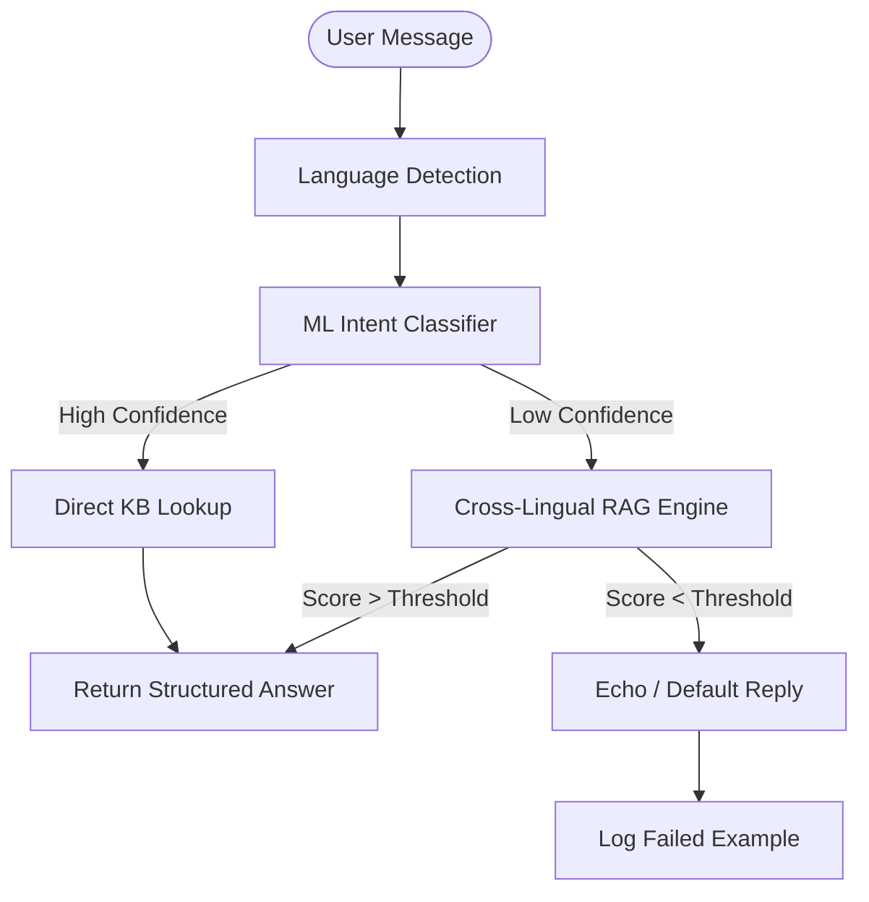

# Agent Architecture: Toros Yazilim Chatbot

This document explains the internal mechanisms, ML flow, and logic of the Toros Yazılım multilingual chatbot to help developers understand and extend the project.

## High-Level Architecture

The bot uses a multi-layered fallback approach to ensure it can answer both structured intents and general knowledge questions across four languages (English, Turkish, Arabic, and Russian).

## Core Mechanisms

### 1. Language Detection Engine
Located in `api/v1/bot.py`, the `_detect_language_from_text` function handles language mismatch detection.

- **Scoring-Based**: It assigns points to candidates (en, tr, ar, ru) based on script evidence and keyword matches.
- **Brand Bias Mitigation**: It strips domain-specific brand names (e.g., "Toros Yazilim", "KIYOS") before analysis.
- **Mismatch Handling**: When a mismatch is detected, the bot suppresses generic "You said: ..." replies and instead triggers a high-priority red error notification in the UI.
- **Suggested Language**: The response include the `suggested_language` code to enable one-click switching in the frontend.

### 2. Intent Classification (ML)
Located in `app/ml/intent_classifier.py`, this is the "brain" for recognized topics.

- **Algorithm**: TF-IDF Vectorization + Logistic Regression.
- **Features**: Character n-grams (3-5) are used instead of words. This makes the model robust across different alphabets (Latin, Arabic, Cyrillic) without needing language-specific tokenizers.
- **Supported Intents**:
  - `cybersecurity`: SIEM, AuthNAC, and general security questions.
  - `business_clients`: Custom development and IT consultancy.
  - `corporate`: About "Toros Yazilim" and general info.
  - `careers`: Recruitment and internships.
  - `greeting`: Welcoming messages (Hello, Merhaba, etc.).
  - `other`: Generic or unknown requests.

### 3. Cross-Lingual RAG Engine
Located in `app/ml/rag_engine.py`, this handles questions that don't match a clear intent.

- **Indexing**: All Knowledge Base entries are indexed as TF-IDF vectors using character n-grams (3-6).
- **Retrieval**: Uses Cosine Similarity to find the best match.
- **Language Boosting**: Entries in the detected user language receive a 2.0x weight boost, while other languages are penalized (0.5x), ensuring preference for the user's native tongue while still allowing cross-lingual discovery.

### 4. Active Learning Loop
Located in `app/ml/active_learning.py`.

- When the bot fails to find a high-confidence answer, it logs the query to `app/data/failed_examples.jsonl`.
- Developers can review these logs, label the correct intents, and re-train the `intent_classifier.py` to improve performance over time.

## Request Lifecycle

1. **Input**: User sends a message and a language preference (from UI).
2. **Detection**: The system detects the *actual* language of the text to check for mismatches.
3. **Intent Match**: The ML model predicts an intent (e.g., "services").
4. **Answer Construction**:
    - If intent confidence is high: Fetch the pre-written answer for that intent in the user's language.
    - If confidence is low: The RAG engine searches the entire KB for a semantic match.
5. **Response**: The bot returns the answer, locale-specific suggestions, and a language hint if a mismatch was detected.

## How to Extend

- **Add Knowledge**: Update `KNOWLEDGE_BASE` in `api/v1/bot.py`. The RAG engine will automatically index new entries on the next request.
- **Add Intent**: Add new examples to `_training_data()` in `intent_classifier.py` and run `evaluate_intents.py` to verify accuracy.
- **Add Language**: Update `SUGGESTIONS_BY_LANG`, `KNOWLEDGE_BASE`, and the `_detect_language_from_text` scoring logic.
