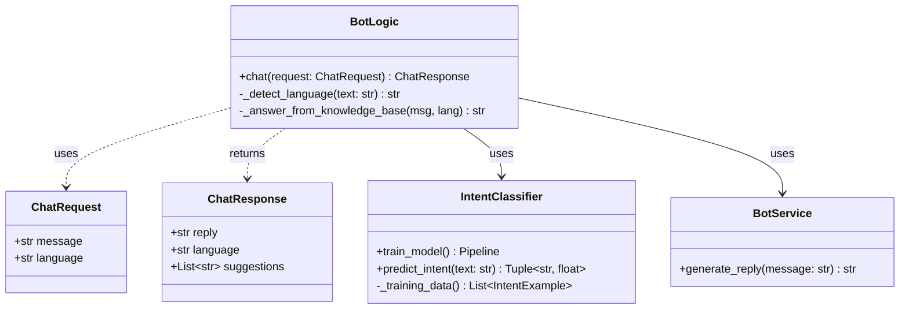
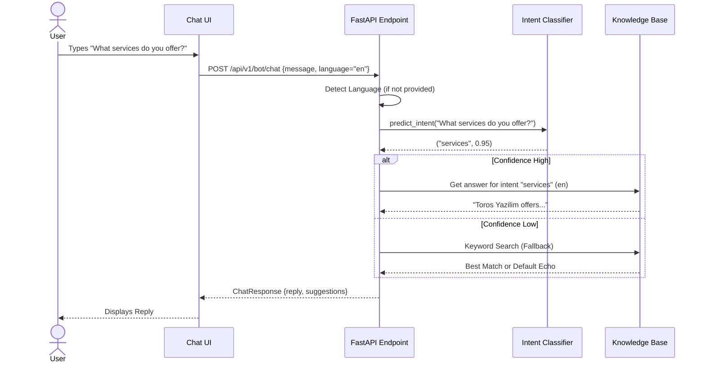

# Toros Yazilim Chatbot - Project Documentation

## 1. Project Overview

This project is a full-stack multilingual chatbot application designed for **Toros Yazilim**. It provides automated responses regarding the company's services, products, contact information, and specific team details.

The system supports four languages:
- **English (en)**
- **Turkish (tr)**
- **Arabic (ar)**
- **Russian (ru)**

It features a modern, responsive web interface and a backend powered by machine learning for intent classification.

---

## 2. Directory Structure

The project is organized into two main directories: **backend** and **frontend**.

```
chatbot/
├── backend/                # Python/FastAPI backend
│   ├── api/v1/             # API routes and schemas
│   │   ├── chat_router.py  # Chat logic, request/response models
│   │   └── router.py       # Router configuration
│   ├── app/
│   │   ├── ml/             # Machine learning components
│   │   │   ├── intent_engine.py     # TF-IDF + Logistic Regression model
│   │   │   ├── knowledge_engine.py  # Cross-lingual KB search
│   │   │   ├── data_collector.py    # Active learning logging
│   │   │   └── model_evaluator.py   # Model evaluation tools
│   │   └── services/       # Business logic services
│   │       └── bot_service.py
│   ├── main.py             # Application entry point
│   └── requirements.txt    # Python dependencies
│
└── frontend/               # React/Vite frontend
    ├── src/
    │   ├── components/
    │   │   └── Chat.tsx    # Main Chat Interface
    │   ├── App.tsx         # Root Component
    │   └── main.tsx        # Entry point
    ├── tailwind.config.cjs # Tailwind CSS configuration
    └── vite.config.ts      # Vite configuration
```

---

## 3. Backend Architecture

### Tech Stack
- **Framework**: FastAPI (Python)
- **ML Libraries**: scikit-learn (TF-IDF Vectorizer, Logistic Regression)
- **Server**: Uvicorn

### Key Components

1.  **API Layer (`backend/api/v1`)**:
    -   **`chat_router.py`**: Defines the `ChatRequest` and `ChatResponse` Pydantic models. It handles the core request flow, including language detection, intent resolution, and response generation.
    -   **endpoints**:
        -   `POST /api/v1/bot/chat`: The main endpoint receiving user messages.

2.  **Machine Learning Layer (`backend/app/ml/intent_engine.py`)**:
    -   Uses a **Pipeline** of `TfidfVectorizer` (character n-grams, `ngram_range=(2, 5)`) and `LogisticRegression` (with `class_weight="balanced"` and `multi_class="ovr"`).
    -   **Consolidated and Granular Intents**:
        -   `company_overview`, `services`, `products`, `contact_info`
        -   `employees`, `greeting`, `cybersecurity`, `makscyber_siem`
        -   `authnac_info`, `identity_management`, `business_clients`, `public_sector`
        -   `it_consultancy`, `career_info`, `custom_software`, `other`
    -   **Data**: Enhanced training set with more categorized examples in 4 languages, specifically refined for `public_sector` and `authnac_info` distinction.
    -   **`predict_intent(text)`**: Returns the predicted intent and confidence score.

3.  **Knowledge Base & Retrieval**:
    -   Data lives in JSON files under `backend/app/data/` and is loaded via `app.core.loader`.
    -   A dictionary structure `KNOWLEDGE_BASE` maps languages to lists of topics.
    -   **Optimized Answers**: Consolidated contact details into `contact_info` and jobs/internships into `career_info` with rich formatting and multi-line responses.
    -   Cross-lingual semantic search is implemented in `backend/app/ml/knowledge_engine.py` using TF-IDF + cosine similarity.

---

## 4. Frontend Architecture

### Tech Stack
- **Framework**: React (TypeScript)
- **Build Tool**: Vite
- **Styling**: Tailwind CSS

### Key Components

1.  **`Chat.tsx`**:
    -   Manages the chat state (`messages`, `input`, `loading`, `activeLocale`, `activeCategoryId`).
    -   Handles API communication via `fetch` to `/api/v1/bot/chat`.
    -   Displays a list of messages with a **Welcome Message** on start.
    -   Provides **Categorical Quick-Reply Suggestions**:
        - Users see 5 main categories initially.
        - Clicking a category reveals its related questions.
        - Includes a "Back" button to return to the category view.

2.  **State Management**:
    -   Uses local React `useState` for simplicity.
    -   Language selection updates the `activeLocale` state, which is sent with every API request to ensure localized responses.

---

## 5. UML Diagrams

### 5.1 Component Diagram

This diagram illustrates the high-level relationship between the user interface and the backend services.

```mermaid
componentDiagram
    package "Frontend (React)" {
        [Chat Interface]
        [HTTP Client]
    }

    package "Backend (FastAPI)" {
        [API Router]
        [Bot Logic]
        [Intent Classifier (ML)]
        [Knowledge Base]
    }

    [Chat Interface] --> [HTTP Client]
    [HTTP Client] --> [API Router] : JSON / HTTPS
    [API Router] --> [Bot Logic]
    [Bot Logic] --> [Intent Classifier (ML)] : Predict Intent
    [Bot Logic] --> [Knowledge Base] : Fallback / Detail Lookup
```

### 5.2 Class Diagram (Backend)

Shows the structure of the data models and main logic classes in the backend.



### 5.3 Sequence Diagram (Chat Flow)

Traces the path of a user message from the UI to the response.


---
+
+## 6. Testing and Quality Assurance
+
+The project maintains high reliability through a tiered testing structure:
+
+1.  **Unit Tests (`pytest`)**: Located in `backend/tests/test_bot_scenarios.py`. These verify the intent classifier's ability to map text to the correct label across all languages.
+2.  **System Tests (`system_test.py`)**: A comprehensive scan that hits the live chat logic with 30+ multilingual queries, ensuring the knowledge base answers are correctly retrieved and formatted.
+3.  **Active Learning**: An automated loop where unrecognized queries are logged for manual review and model refinement.
+
+### Execution
+Tests can be run using the root runner:
+```bash
+./run_tests.sh
+```
+
+For more details, see the [TESTING_WORKFLOW.md](./TESTING_WORKFLOW.md).
